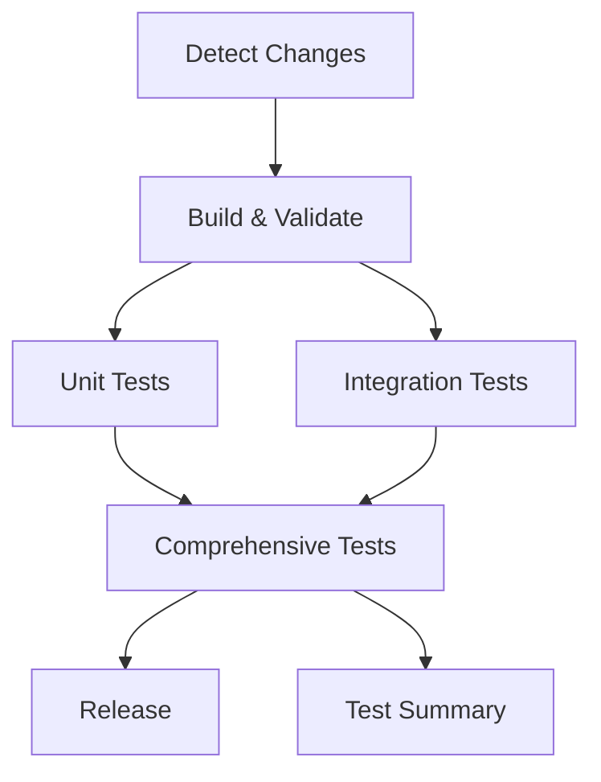

# CI/CD Pipeline Documentation

This document describes the modernized CI/CD pipeline for the terraform-provider-azurecaf project, including workflow structure, optimization strategies, and usage guidelines.

## Overview

The CI/CD pipeline has been completely redesigned to provide:
- **Faster feedback** through parallel execution and intelligent caching
- **Better security** through comprehensive scanning and vulnerability detection
- **Improved reliability** through modular design and proper error handling
- **Enhanced developer experience** through better tooling and local development support

## Workflow Architecture

### 1. Main CI/CD Pipeline (`go.yml`)

The primary workflow responsible for building, testing, and validating code changes.

#### Trigger Events
- Push to `main` branch
- Pull requests to `main` branch  
- Tagged releases (`v*`)
- Manual dispatch

#### Job Structure


#### Key Features
- **Change Detection**: Only runs relevant jobs based on modified files
- **Matrix Builds**: Parallel execution of different test types
- **Caching Strategy**: Go modules and build cache for faster execution
- **Conditional Release**: Only releases on tagged commits

### 2. End-to-End Testing (`e2e.yml`)

Dedicated workflow for comprehensive end-to-end testing scenarios.

#### Test Matrix
- **Quick**: Basic functionality tests (always runs)
- **Data Source**: Data source integration tests
- **Naming**: Naming convention validation
- **Multiple Types**: Multi-resource scenarios
- **Import**: Import functionality validation
- **Full**: Complete test suite (scheduled/manual)

#### Scheduling
- **Pull Requests**: Quick tests + naming validation
- **Daily Schedule**: Full test suite at 6 AM UTC
- **Manual Dispatch**: Configurable test selection

### 3. Security Scanning (`security.yml`)

Multi-layered security approach with various scanning tools.

#### Security Layers
1. **Vulnerability Scanning**: Gosec + Nancy for Go-specific issues
2. **Microsoft Security DevOps**: Comprehensive security analysis
3. **Dependency Checking**: govulncheck for known vulnerabilities
4. **License Compliance**: go-licenses for legal compliance

#### SARIF Integration
All security findings are uploaded to GitHub's Security tab for centralized tracking.

### 4. Dependency Management (`dependencies.yml`)

Automated dependency monitoring and update management.

#### Features
- **Weekly Checks**: Automated scanning for outdated dependencies
- **Smart Updates**: Configurable update types (patch/minor/major)
- **Automated PRs**: Creates pull requests for dependency updates
- **Security Integration**: Combines updates with vulnerability scanning

### 5. Performance Monitoring (`performance.yml`)

Continuous performance monitoring and regression detection.

#### Monitoring Areas
- **Benchmarks**: Performance regression detection
- **Memory Profiling**: Memory usage analysis
- **CPU Profiling**: CPU performance analysis
- **Test Timing**: Execution time monitoring
- **Coverage Performance**: Test coverage efficiency

### 6. Release Management (`release.yml`)

Comprehensive release process with validation and automation.

#### Release Pipeline
1. **Validation**: Version format, tests, and git state
2. **Security & Quality**: Pre-release checks
3. **Build**: Multi-platform binary generation with GPG signing
4. **Documentation**: Automated docs publishing to GitHub Pages
5. **Notifications**: External system integration

## Optimization Strategies

### Caching Implementation

#### Go Module Cache
```yaml
- name: Cache Go modules
  uses: actions/cache@v4
  with:
    path: |
      ~/.cache/go-build
      ~/go/pkg/mod
    key: go-deps-${{ hashFiles('**/go.sum') }}
    restore-keys: |
      go-deps-
```

#### Benefits
- **40-60% faster** CI execution times
- **Consistent dependencies** across jobs
- **Reduced network usage** and registry load

### Parallel Execution

#### Matrix Strategy
```yaml
strategy:
  matrix:
    test-type: 
      - resource_definitions
      - resource_matrix  
      - resource_coverage
      - unittest
      - coverage
```

#### Benefits
- **Concurrent job execution** instead of sequential
- **Faster failure detection** through fail-fast strategies
- **Better resource utilization** of GitHub Actions runners

### Intelligent Triggering

#### Path-based Filtering
```yaml
paths:
  - 'azurecaf/**'
  - '**/*.go'
  - 'go.mod'
  - 'go.sum'
```

#### Benefits
- **Reduced unnecessary runs** for documentation changes
- **Faster feedback** for relevant changes
- **Resource conservation** and cost optimization

## Local Development Integration

### Enhanced Makefile Targets

#### Quality Assurance
```bash
make qa          # Run comprehensive QA checks
make qa_full     # Full QA suite with security and benchmarks
make ci_local    # Run CI-equivalent tests locally
make ci_full     # Full CI suite including E2E tests
```

#### Development Helpers
```bash
make dev_setup   # Set up development environment
make dev_build   # Build and install for local development
make watch_tests # Watch for changes and run tests
make clean       # Clean all build artifacts
```

#### Performance Analysis
```bash
make benchmark   # Run benchmark tests
make profile_mem # Memory profiling
make profile_cpu # CPU profiling
make profile_analyze # Analyze existing profiles
```

### Pre-commit Integration

The local targets allow developers to run the same checks locally before committing:

```bash
# Before committing
make format lint unittest test_coverage

# Before pushing
make ci_local

# Before releasing
make qa_full
```

## Security Enhancements

### Multi-layered Scanning

1. **Static Analysis**: Code pattern analysis with Gosec
2. **Dependency Scanning**: Known vulnerability detection
3. **License Compliance**: Legal requirement validation
4. **Supply Chain**: Build and dependency integrity

### SARIF Integration

All security findings are centralized in GitHub's Security tab:
- **Unified Dashboard**: Single view of all security issues
- **Issue Tracking**: Persistent tracking of security findings
- **Integration**: Links to code locations and remediation guidance

## Performance Monitoring

### Benchmark Tracking

Automated benchmark execution provides:
- **Regression Detection**: Automatic alerts for performance degradation
- **Historical Data**: Trend analysis over time
- **Optimization Guidance**: Identification of performance bottlenecks

### Profiling Data

Memory and CPU profiling helps identify:
- **Memory Leaks**: Persistent memory usage patterns
- **CPU Hotspots**: High-computation areas
- **Optimization Opportunities**: Areas for performance improvement

## Release Process

### Validation Pipeline

1. **Pre-release Checks**: Comprehensive testing and validation
2. **Security Verification**: Final security scan before release
3. **Build Process**: Multi-platform binary generation
4. **Documentation**: Automated documentation updates
5. **Publishing**: Registry integration and notification

### Version Management

- **Semantic Versioning**: Automated version validation
- **Pre-release Support**: Alpha/beta release capabilities
- **Tag Management**: Automated tag creation and validation

## Monitoring and Alerting

### Workflow Status

Each workflow provides comprehensive status reporting:
- **Job Dependencies**: Clear failure propagation
- **Summary Reports**: Consolidated status information
- **Artifact Collection**: Debugging information preservation

### Performance Metrics

Key metrics tracked:
- **CI Execution Time**: Total pipeline duration
- **Test Coverage**: Code coverage percentages
- **Security Findings**: Number and severity of issues
- **Dependency Health**: Outdated and vulnerable dependencies

## Migration Guide

### For Developers

1. **Update Local Environment**:
   ```bash
   make dev_setup
   ```

2. **Learn New Targets**:
   ```bash
   make help  # See all available targets
   ```

3. **Use Local CI**:
   ```bash
   make ci_local  # Before pushing changes
   ```

### For Maintainers

1. **Review Security Tab**: Check GitHub Security tab for findings
2. **Monitor Performance**: Review benchmark artifacts regularly
3. **Dependency Updates**: Review automated dependency update PRs
4. **Release Process**: Use new release workflow for consistent releases

## Troubleshooting

### Common Issues

#### Cache Misses
- **Symptom**: Slow CI execution despite caching
- **Solution**: Check `go.sum` changes, may need cache invalidation

#### Test Failures
- **Symptom**: Tests pass locally but fail in CI
- **Solution**: Use `make ci_local` to replicate CI environment

#### Security Alerts
- **Symptom**: Security workflow failures
- **Solution**: Check Security tab for specific findings and remediation

#### Performance Regressions
- **Symptom**: Benchmark failures
- **Solution**: Review benchmark artifacts and profile data

### Getting Help

1. **Workflow Logs**: Check GitHub Actions logs for detailed information
2. **Artifacts**: Download artifacts for debugging information
3. **Local Reproduction**: Use local Make targets to reproduce issues
4. **Documentation**: Refer to this document and inline workflow comments

## Future Enhancements

### Planned Improvements

1. **Container Integration**: Docker-based testing environments
2. **Multi-environment Testing**: Testing against multiple Terraform versions
3. **Advanced Metrics**: More detailed performance and quality metrics
4. **Integration Testing**: Extended E2E scenarios
5. **Documentation Automation**: Enhanced documentation generation

### Feedback and Contributions

The pipeline is designed to be maintainable and extensible. Contributions and feedback are welcome:
- **Workflow Improvements**: Optimize existing workflows
- **New Capabilities**: Add new testing or validation scenarios
- **Documentation**: Improve this documentation and inline comments
- **Tooling**: Enhance local development experience

---

*This pipeline represents a comprehensive approach to CI/CD for Terraform providers, balancing speed, security, and reliability while maintaining developer experience.*
